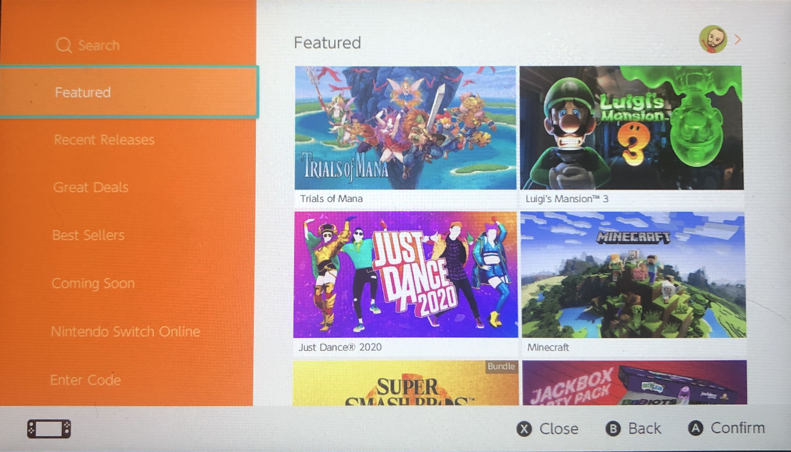
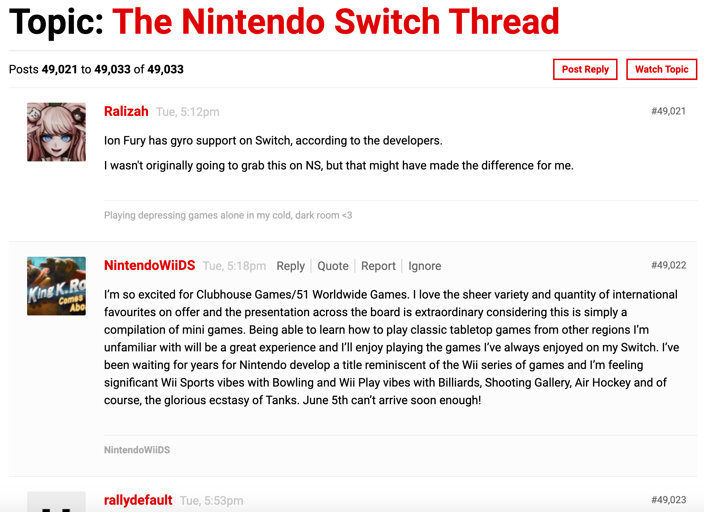
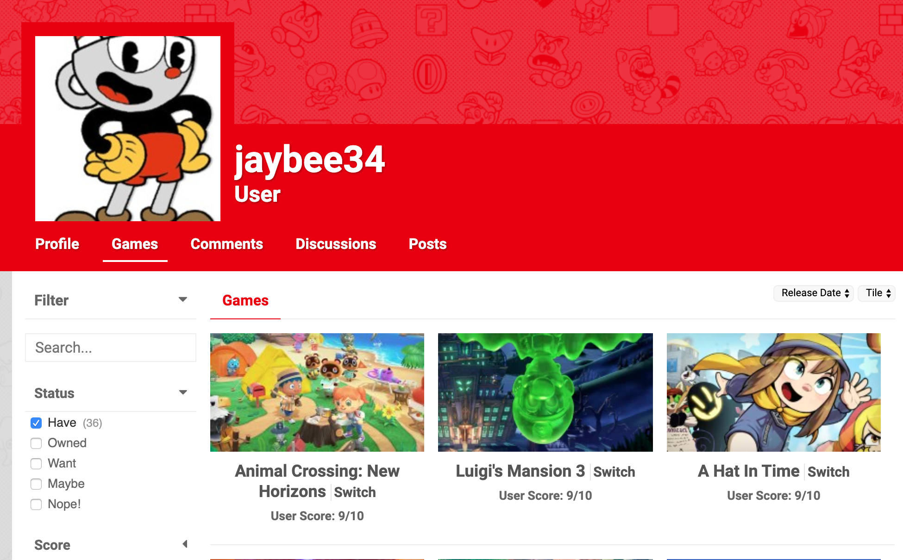
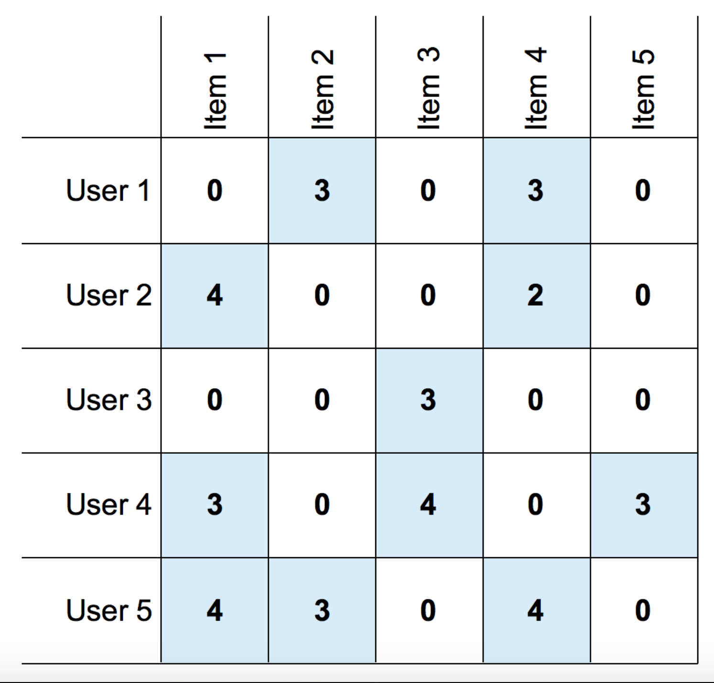
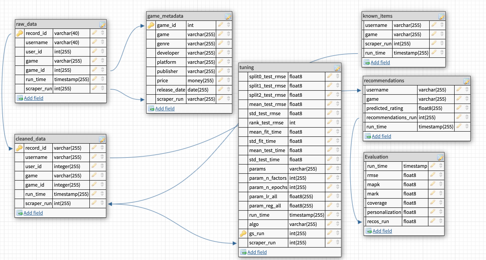

# Building a Nintendo Switch Game Recommender From Scratch

In this project, I used Python to build an end-to-end recommender system for Nintendo Switch games.

With over 2300 games available to download on the current Nintendo Switch eShop, finding a new game to play and download can be overwhelming. While the eShop does have a few easy methods for finding new games, unless you are searching for something specific, it may be difficult for some to find games to play in the current iteration of the eShop. The current eShop home page layout is depicted below:

As you can see, while there are ways to find featured games, recent releases, best sellers and games on sale, the eShop page is very generic. There are no elements of personalization recommendation besides what is popular, new or on sale. 
I believe that adding game recommendations to the Switch eShop can help Switch owners find more to play.

## Data Collection
As Nintendo themselves doesn't offer any data around users and their gaming habits, I looked to NintendoLife.com, a popular Nintendo fan website, to find data to build my recommender system. NintendoLife's site offers Nintendo news, game reviews, opinion articles, as well as the ability for users to rate games, create a profile displaying their game collection, and interact with other users on forums. To scrape data from NintendoLife.com, I used Python's BeautifulSoup library.
To begin the data collection process, we start by scraping NintendoLife's forums for usernames. The forums contain thousands of posts from different users:

Once users are collected, I scrape games and ratings from each user's page. An example of a user page is shown here:

This scraping process provides us with a robust dataset of users, games and ratings, which I use to train our recommender system model. I also collect metadata about each game, including the game's genre, price, developer and release date. Game metadata may be used in a future implementation of the recommender system model that includes features about our content (in this case, games).

All that is necessary to begin the scraping process is a list of thread names from NintendoLife.com. These can be changed within our configuration and need to be set at the beginning of our recommendation process. 

## Modeling
I utilized the Surprise library in Python to train my recommender system module. Specifically, I use Surprise's implementation of the famous SVD algorithm. This algorithm decomposes a sparse user-item-rating matrix into a number of latent item and user factors, and then uses baseline ratings, regularization terms, and the dot product between the latent factors to run SGD and eventually predict missing ratings with the lowest possible training loss. 
I tuned the model with Surprise's GridSearchCV function, using number of latent factors, number of training epochs (for SGD), learning rate and regularization term as tuning parameters. 
Once our model is tuned, I create a sparse user-item-rating matrix based on our scraped data. An example of a sparse user-item-rating matrix is seen here:

I then use our trained SVD model to predict a rating for each unrated game in our sparse user-item-rating matrix. 

## Evaluation
Once the sparse matrix is filled in, I'm able to sort the predicted ratings for each user's unrated games from highest to lowest, and create a list of top n recommendations for each user based on the predicted ratings. 
I evaluated my model by the following metrics: RMSE, MAP@K (mean average precision @ K), MAR@K (mean average recall @ K), coverage score and personalization %. While RMSE, MAP@K and MAR@K are evaluated in a typical machine learning training/testing methodology, we can evaluate coverage score and personalization % based on recommendations.
Coverage score is defined as the % of unique items that our recommender system recommends divided by the total number of unique items in our dataset. Personalization score is a measure of how similar each user's recommendations are to one another, with regard to each recommendation. For my most recent model run, evaluation metrics were as follows:
* RMSE: 1.02
* MAP@K: 0.86
* MAR@K: 0.81
* Coverage: 9.38%
* Personalization: 52.1%

## Database
I created a postgresql database to store the results of my scraper, modeling, recommendations and evaluation. The database schema is laid out here:

## Web App
I also created a 
